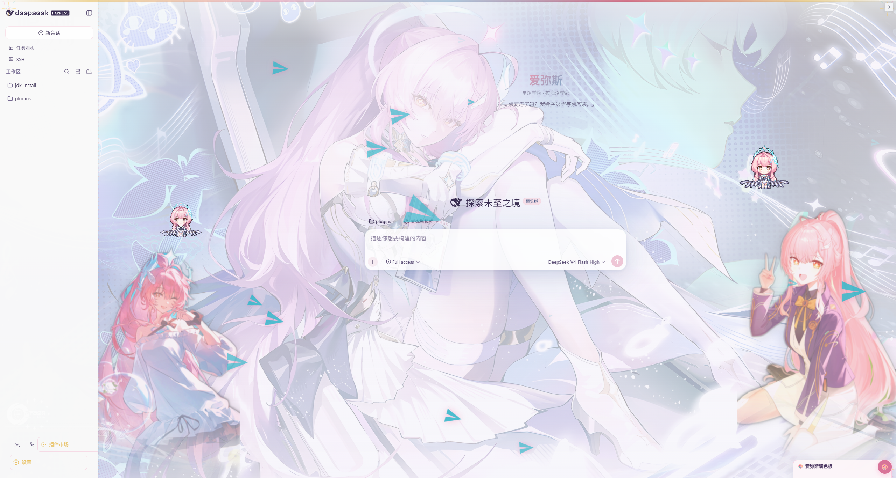
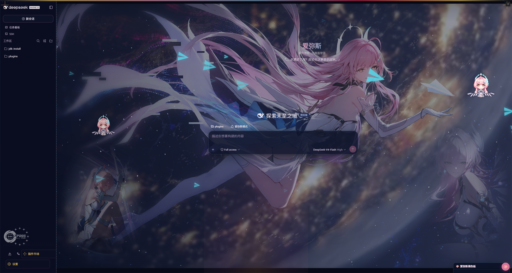

# dsh-client-ui-skin-aemeath · 爱弥斯 · 星炬回响

DeepSeek Harness Web GUI 的鸣潮爱弥斯主题皮肤，**独立插件形态**（cordis bundle，denia 皮肤同款）。走 DSH 官方 web 插件管线，**不依赖皮肤中心**，提供一个 **DSH 设置区界面开关**整体启用/停用皮肤。

## 效果预览

| 星炬白昼（亮色） | 幽灵之夜（暗色） |
|---|---|
|  |  |

> 预览图取自用户壁纸素材，亮/暗各一张。

## 特性

- **双形态切换**：星炬白昼（亮色）/ 幽灵之夜（暗色），主题联动背景与立绘（`body[data-ds-dark-theme]` 驱动）
- **左右立绘**：亮/暗各一套（粉发少女半透明氛围 + 底部渐隐融入背景），跟随主题自动切换
- **背景插画**：亮色=4K 壁纸（粉发少女蝴蝶光效）、暗色=太空壁纸（星球纸飞机），带渐变遮罩（scrim）
- **程序化装饰**：数据粒子场（前后双层）、数据流链边框、四角星火花、学院徽章、favicon、标题栏 wordmark
- **欢迎界面**：新会话 hero 台词（「……你要走了吗？我会在这里等你回来。」）
- **🎨 调色板**：右下角浮动面板 + DSH 设置区双入口，立绘显隐 / 高度 / 水平偏移、粒子场与数据流边框开关等，持久化到 profile 文件
- **🌈 回复文字配色**：助手消息正文与代码/链接/强调等分元素上色（亮暗两套配色），见下方「回复文字配色」一节
- **交互安全**：全部装饰层 `pointer-events:none`，不拦截任何点击与输入

## 安装

```sh
# 本地路径（或 git url）
dsh plugin --profile <name> add ./aemeath-skin
# 或从 GitHub 直接安装
dsh plugin --profile <name> add https://github.com/1691695205/aemeath-skin
```

重启 DSH 后生效。

### 界面开关与设置区

皮肤设置挂在 **DSH 设置界面 → 插件 → `ui-skin-aemeath`**，全部控件即时生效、持久化到 profile 文件：

| 控件 | 类型 | 范围/选项 | 默认 |
|---|---|---|---|
| **enabled** | 开关 | 启用 / 停用（总开关，关=整皮肤卸载回默认界面） | 开 |
| left / right | 开关 | 左 / 右立绘显示 | 开 |
| charHeight | 滑块 | 立绘高度 30–80vh | 55vh |
| offsetX | 滑块 | 立绘水平偏移 −200–200px | 0px |
| bubbles | 开关 | 粒子场 | 开 |
| bubbleCount | 滑块 | 泡泡数量 5–40 | 20 |
| bubbleSpeed | 滑块 | 泡泡速度 30–200% | 100% |
| chain | 开关 | 数据流边框 | 开 |
| corners | 开关 | 四角星芒 | 开 |
| emblem | 开关 | 学院徽章 | 开 |
| **msgColor** | 开关 | 回复文字配色 | 开 |
| msgFrame | 开关 | 消息文本框 | 关 |
| msgOpacity | 滑块 | 文本框透明度 20–100% | 68% |
| contentWidth | 滑块 | 对话宽度 400–1200px | 600px |
| bgOpacity | 滑块 | 背景透明度 20–100% | 100% |

- **持久化**：`profiles/<name>/data/dsh-client-ui-skin-aemeath/settings.json`，刷新、重启、清浏览器存储都不丢
- **总开关关闭** = 完整卸载：移除装饰 DOM、恢复 body 背景样式、移除注入的 CSS，回到 DSH 默认界面；设置区里再打开立即恢复
- **调色板面板**：右下角 🎨 浮动面板与设置区控件同一数据源，任意一处改动两边同步

## 文件结构

```
├── package.json          # dsh.bundle.patch → cordis.patch.yml；dsh.client.platform: web
├── cordis.patch.yml      # insert ui-skin-aemeath 到 web 插件名单
├── lib/index.js          # 宿主端：/api/dsh-aemeath/settings (GET/PUT) + installSettingsSection 设置区
├── lib/client.js         # 浏览器端：内联素材 + skin.css + 装饰管线 + 开关轮询（构建产物）
├── scripts/build-client.mjs  # 从 client.template.mjs + assets + skin.css 生成 lib/client.js
├── lib/client.template.mjs   # client 源码模板（占位符由构建脚本填充）
├── skin.css              # 皮肤样式（构建时内联进 client.js）
└── assets/               # 立绘 / 背景 / SVG 装饰素材（构建时 base64 内联）
```

> **构建**：改动 `assets/` 或 `skin.css` 后运行 `node scripts/build-client.mjs` 重新生成 `lib/client.js`（素材以 base64 内联，构建产物体积约 13MB）。

## 回复文字配色（🌈）

皮肤会对**助手回复正文**做分元素上色，亮/暗各一套配色，覆盖正文、标题、链接、强调、代码、引用、列表、表格与分隔线：

| 元素 | 亮色（星炬白昼） | 暗色（幽灵之夜） |
|---|---|---|
| 正文 | `#7A4E8A` 粉紫 | `#D0A8E0` 粉紫 |
| 标题 h1–h3 | 粉→玫→金渐变 | 粉→青渐变 |
| 链接 | `#B84E78` 玫红 | `#F0A0C0` 亮玫红 |
| 强调 strong/em/b | `#B84E78` 玫红加粗 | `#F2A8C6` 亮玫红加粗 |
| 行内代码 | `#4C7FA0` 青蓝 + 浅青底 | `#8FD3E8` 亮青 + 青底 |
| 代码块 pre | 青蓝底 + 暖金左条 | 青底 + 暖金左条 |
| 引用 blockquote | 次级紫 + 金边 | 亮紫 + 金边 |
| 列表标记 | 玫红 | 亮玫红 |
| 表格 | 玫红边框 / 表头 | 青边框 / 青表头 |
| 分隔线 | 暖金 | 暖金 |

**机制说明**：

- **锚点**：client.js 内置「消息标记器」，轮询为每条助手消息容器（`data-chat-flow-kind="assistant"` / `"assistant-step"`，找不到时回退 `[data-streaming]` / 官方 markdown 类）打上 `data-aemeath-msg` 属性
- **样式**：`skin.css` 的「⑭ MESSAGE TEXT PALETTE」段以 `[data-aemeath-msg]` 为作用域写分元素配色；正文同时重映射官方 token `--dsw-alias-label-primary` 并 `!important` 兜底，保证压过官方默认色
- **调色**：改 `skin.css` 中「⑭」段的色值即可，无需动 client；改完运行构建脚本并重启 DSH 生效

## 兼容性

- DSH Web：`0.1.0-rc.6 ~ 0.1.1-rc.2`（`dsh.client.version` 声明区间）
- 依赖：`schemastery`（dependencies）、`@deepseek-ai/dsh-settings`（peer，由 DSH 共享层提供）、`@deepseek-ai/cordis`（peer）
- 不依赖皮肤中心

## 更新记录

### v1.0.0 — 2026-08-25

- 独立插件形态（cordis bundle）：`package.json`、`cordis.patch.yml`、`lib/index.js`、`lib/client.js`、`scripts/build-client.mjs`
- **DSH 设置区开关**：`ui-skin-aemeath` 设置区（`enabled` 总开关 + 15 项调色板控件），关=皮肤完整卸载回默认界面
- **profile 持久化**：设置存 `profiles/<name>/data/dsh-client-ui-skin-aemeath/settings.json`
- 宿主端设置 API：`GET/PUT /api/dsh-aemeath/settings`（loopback 鉴权、字段校验、原子写）
- 浮动 🎨 调色板面板（与设置区同一数据源）
- client bundle 按 DSH `__ModuleLoader__.load({ id, factory })` 契约注册；不依赖 `dsh.client.inject` 注入链，主题检测自实现（`body[data-ds-dark-theme]` + MutationObserver）
- 移除皮肤中心 v2 形态（`skin.json` / `hooks.mjs` / `preview/`）

## 参考项目

- 工程结构参考 [Ewnscat-ya/dsh-client-ui-skin-denia](https://github.com/Ewnscat-ya/dsh-client-ui-skin-denia)（模块加载工厂模式、双形态舞台架构、调色板面板、DOM 装饰逻辑）

## 致谢

| 来源 | 说明 |
|---|---|
| [dsh-client-ui-skin-denia](https://github.com/Ewnscat-ya/dsh-client-ui-skin-denia)（Ewnscat） | 皮肤工程结构、调色板面板与 DOM 装饰逻辑 |

## 版权与许可

「鸣潮」游戏作品及爱弥斯（Aemeath）角色形象版权归 **Kuro Games（库洛游戏）**所有；「星炬学院 / 拉海洛 / 隧者之剑 / 声痕」为相关设定。角色立绘 / 背景素材由用户自行提供。

本皮肤为**同人创作**，与 Kuro Games 无关联；仓库以 **CC BY-NC-SA 4.0**（署名-非商业性使用-相同方式共享）发布，署名链见 `NOTICE`。
